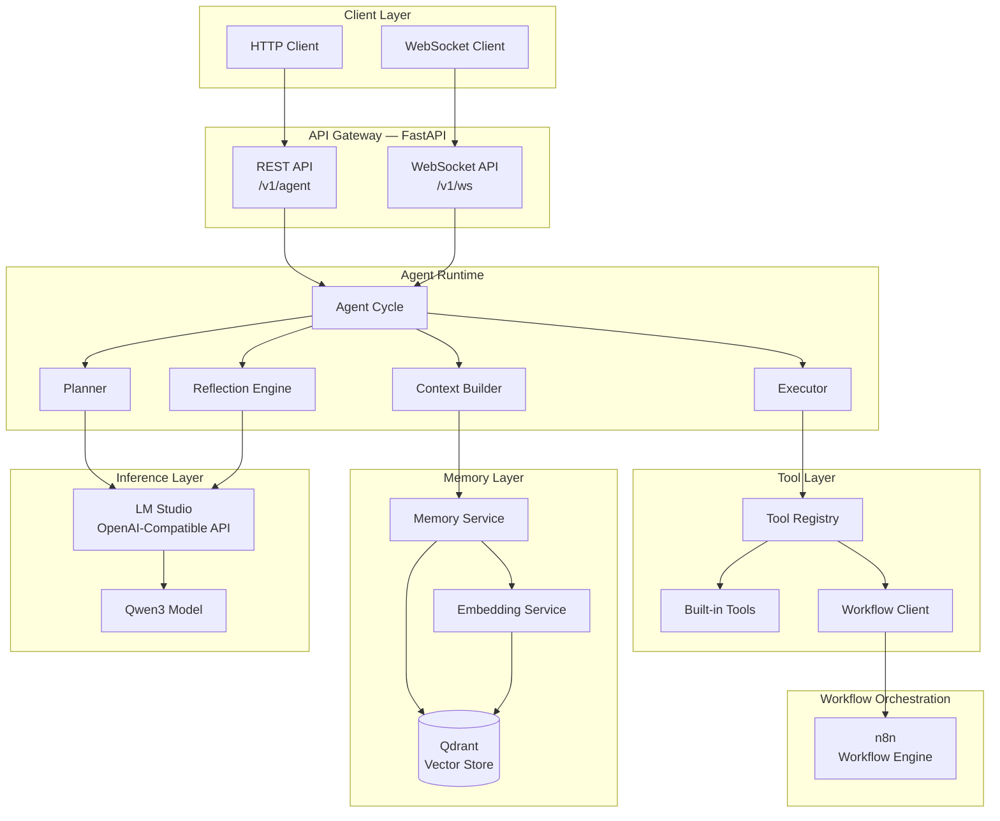
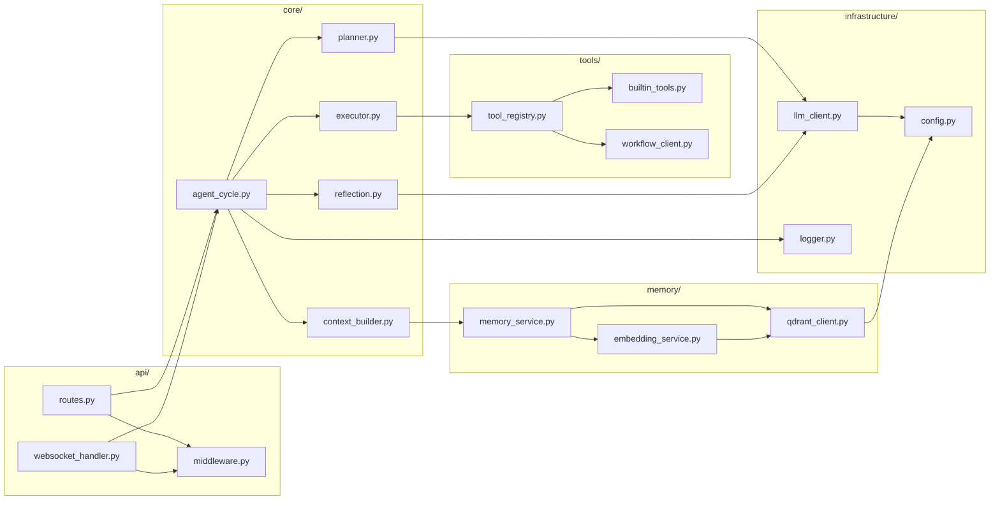
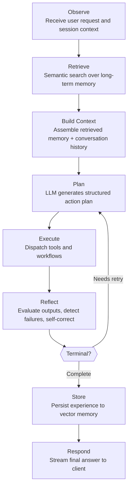
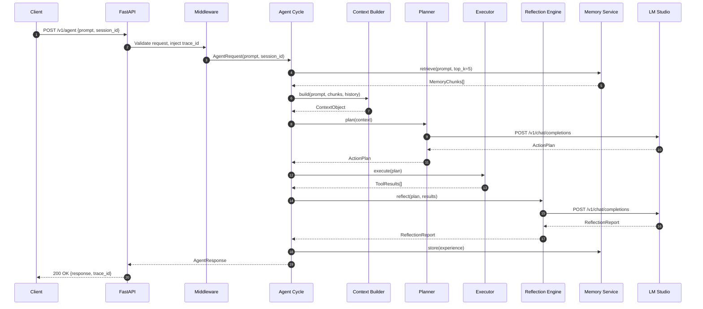
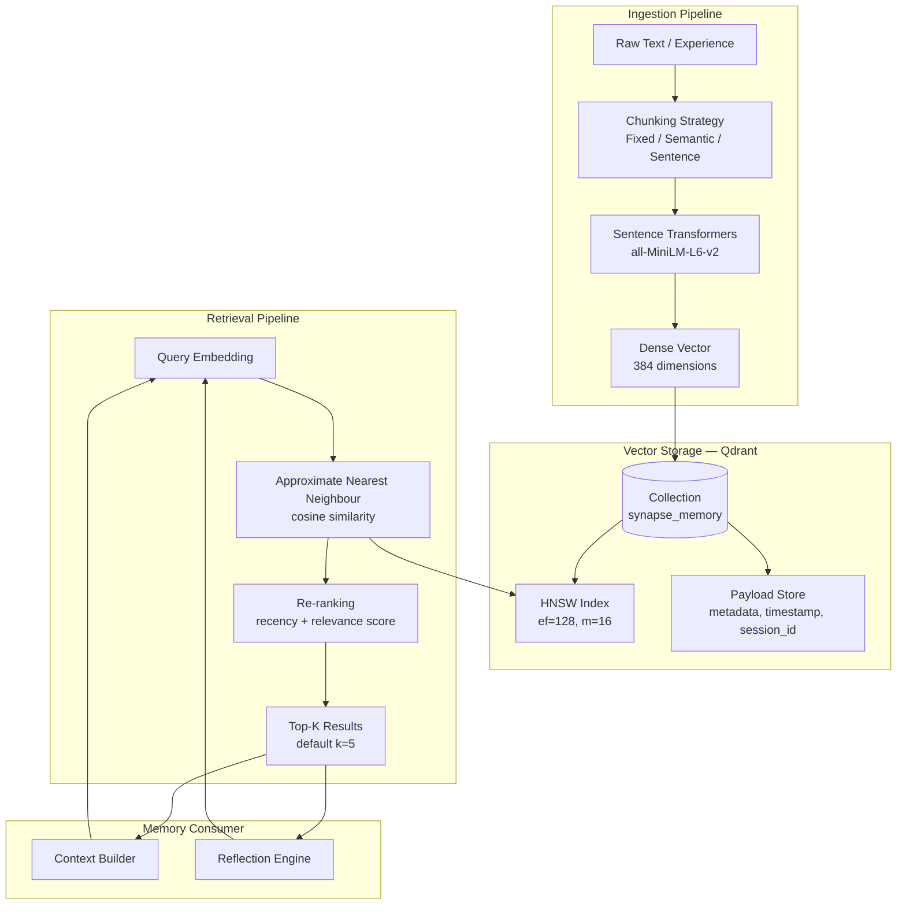
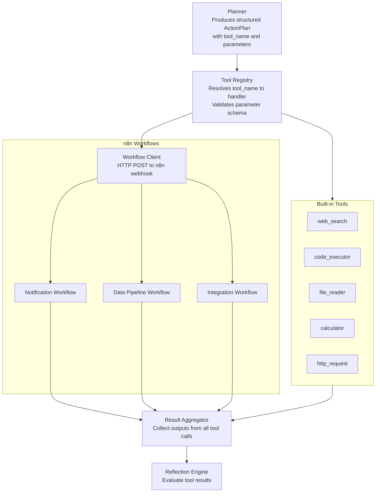
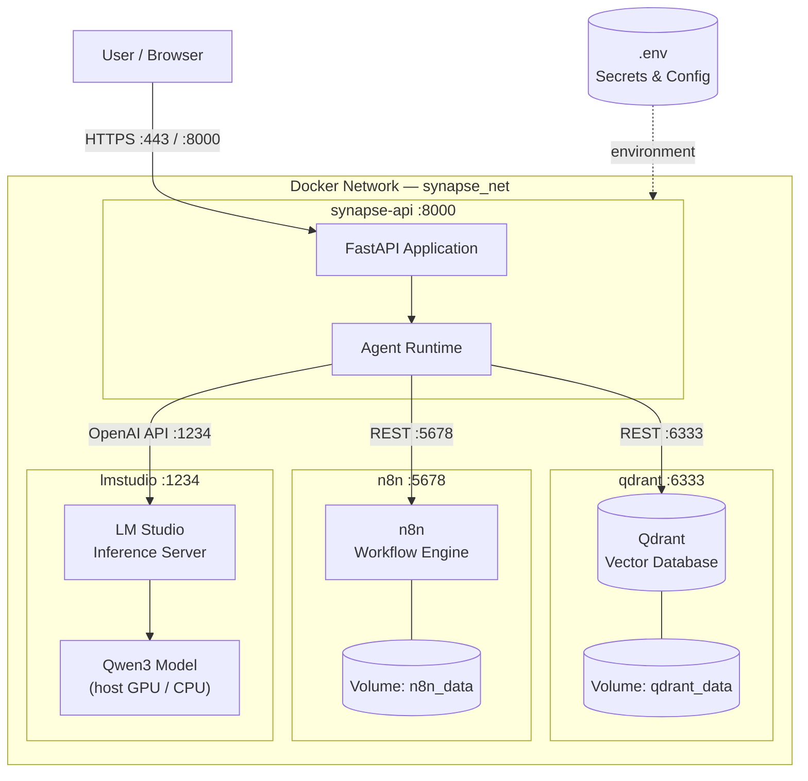
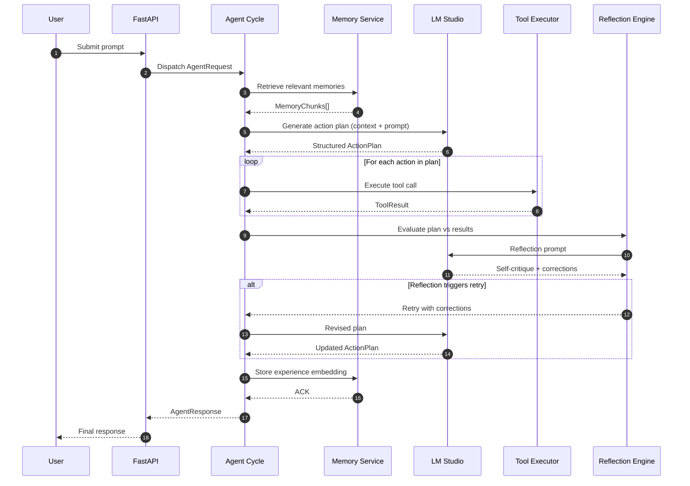
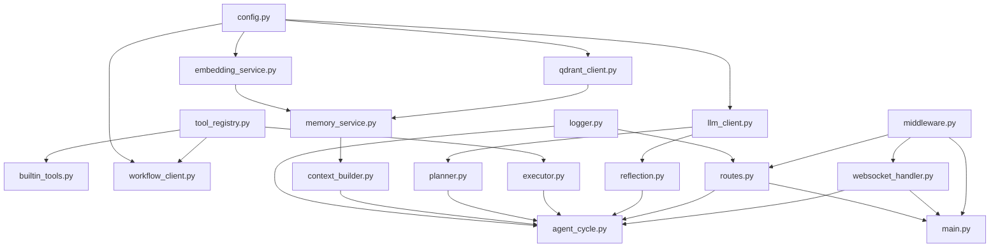
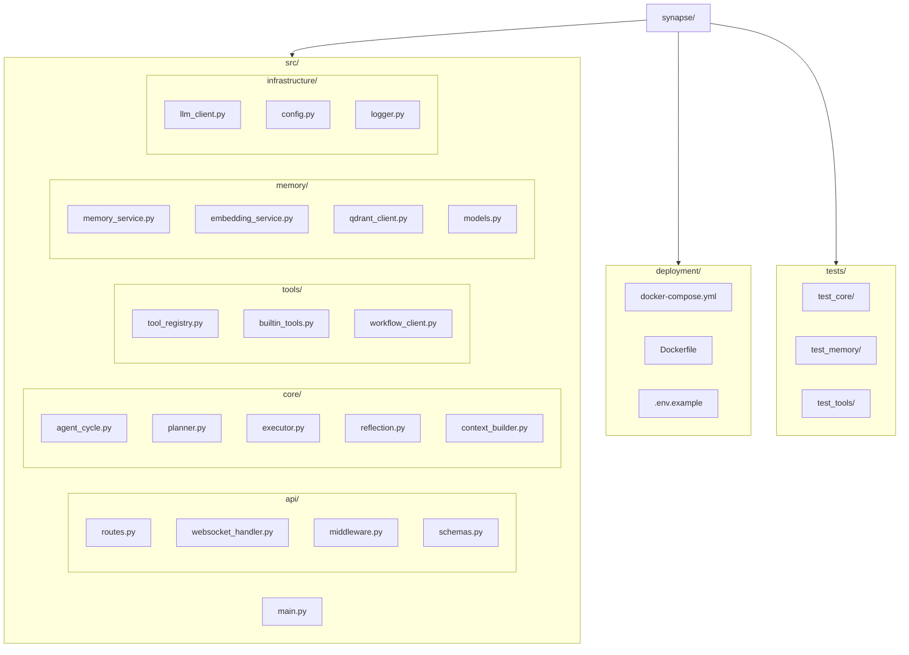

# Synapse — Architecture Diagrams

> Enterprise-grade architecture documentation for the Synapse autonomous AI agent platform.

---

## 1. High-Level System Architecture

---

## 2. Component Architecture

---

## 3. Autonomous Agent Workflow

---

## 4. Request Lifecycle

---

## 5. Memory Architecture

---

## 6. Tool Execution Flow

---

## 7. Deployment Architecture

---

## 8. Sequence Diagram — Full Agent Interaction

---

## 9. Project Dependency Graph

---

## 10. Backend Package Structure

---

*Generated for the Synapse autonomous AI agent platform.*
